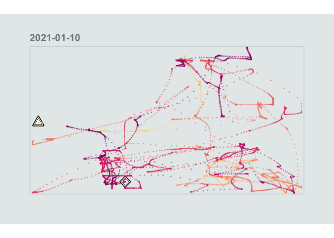
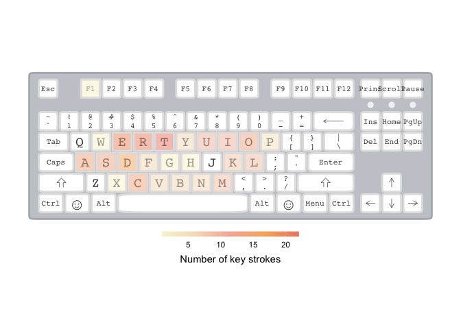

<!-- README.md is generated from README.Rmd. Please edit that file -->

# deviz

<!-- badges: start -->

[](https://codecov.io/gh/marcosci/deviz?branch=master)
[](https://www.tidyverse.org/lifecycle/#experimental)
[](https://github.com/marcosci/deviz/actions)
<!-- badges: end -->

/dɪˈvaɪz/ (device + vizualisation)

## Input device tracking and visualization in R

deviz allows to track computer input device tracking and the
vizualisation of the tracked data. deviz wraps the the python package
, which
allows us to collect the mouse movement and keyboard strokes data.

## Installation

You can install the development version from
[GitHub](https://github.com/) with:

``` r
# install.packages("devtools")
devtools::install_github("marcosci/deviz")
```

## Example

### Mouse

#### Mouse movement tracking

If you want to track your mouse, just run:

``` r
library(deviz)
mouse_df <- track_mouse("00h00m90s")
```

… this will track your mouse for 90 seconds, but also block your R
console. If you use RStudio, the most convienent way to track your mouse
movement with `deviz` is to run
`track_mouse("00h00m90s", as_job = TRUE)`. This launches the function as
an RStudio job, which at its end returns a `mouse_df` object with the
tracked data.

The returned contains information about the type of mouse input
(movement, click, scroll) and further information about the specific
event:

``` r
mouse_df
#> # A tibble: 14,251 x 8
#>    type      x     y button pressed dx    dy    date               
#>    <chr> <dbl> <dbl> <chr>  <chr>   <chr> <chr> <dttm>             
#>  1 Click  107. 1047. left   False   <NA>  <NA>  2021-01-10 14:45:46
#>  2 Move   108. 1047. <NA>   <NA>    <NA>  <NA>  2021-01-10 14:45:47
#>  3 Move   108. 1047. <NA>   <NA>    <NA>  <NA>  2021-01-10 14:45:47
#>  4 Move   109. 1047. <NA>   <NA>    <NA>  <NA>  2021-01-10 14:45:47
#>  5 Move   110. 1047. <NA>   <NA>    <NA>  <NA>  2021-01-10 14:45:47
#>  6 Move   110. 1047. <NA>   <NA>    <NA>  <NA>  2021-01-10 14:45:47
#>  7 Move   111. 1047. <NA>   <NA>    <NA>  <NA>  2021-01-10 14:45:47
#>  8 Move   113. 1047. <NA>   <NA>    <NA>  <NA>  2021-01-10 14:45:47
#>  9 Move   114. 1047. <NA>   <NA>    <NA>  <NA>  2021-01-10 14:45:47
#> 10 Move   115. 1047. <NA>   <NA>    <NA>  <NA>  2021-01-10 14:45:47
#> # … with 14,241 more rows
```

### Visualize mouse movement

``` r
visualize_mouse(mouse_df, type = "dot")
```



### Keyboard

#### Keyboard strokes tracking

Equivalent to the way we can track mouse movement, we can track the key
strokes in a given time interval:

``` r
library(deviz)
key_df <- track_keyboard("00h00m90s")
```

There is also the possibility to run this command as an RStudio Job.

### Visualize mouse movement

``` r
visualize_keyboard(key_df)
```



## Code of Conduct

Please note that the deviz project is released with a [Contributor Code
of
Conduct](https://contributor-covenant.org/version/2/0/CODE_OF_CONDUCT.html).
By contributing to this project, you agree to abide by its terms.
