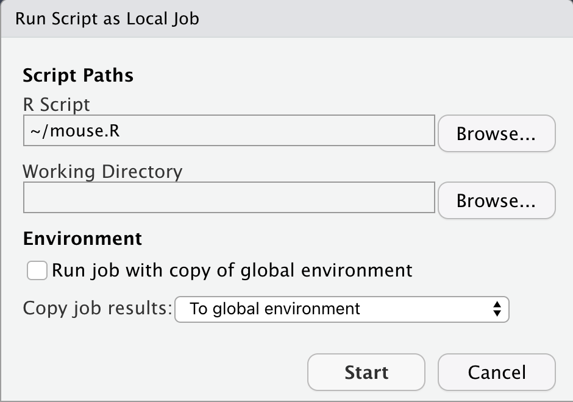

```{r, include = FALSE}
knitr::opts_chunk$set(
  collapse = TRUE,
  comment = "#>"
)
```

If you use RStudio, the most convienent way to track your mouse movement with `ggmouse` is to use the jobs pane. Just create somewhere a file like the following:

```r 
library(ggmouse)

mouse_file <- tempfile(fileext = ".txt")
track_mouse("00h00m90s", mouse_file)

momove <- import_mouse(mouse_file)

visualize_mouse(momove, "tinygrid")
```

... and specify everything in there that is of interest to you. The time, maybe you don't want to save the coordinates in a tempfile or you don't want to immediately plot the data.

Then run the job with the following settings:

<center>
 
</center>
